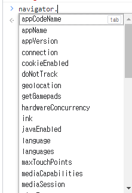
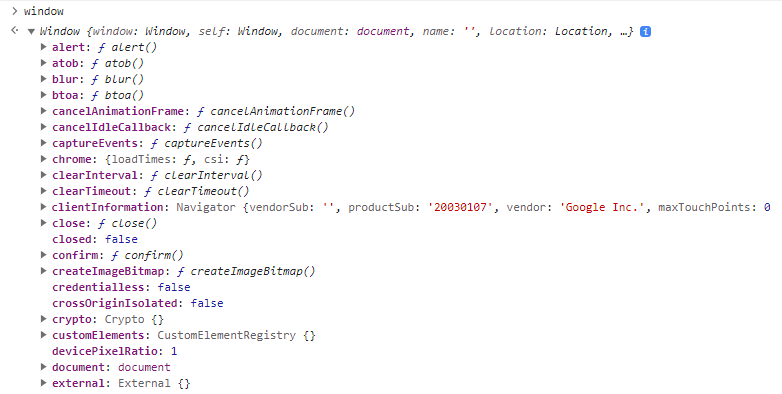
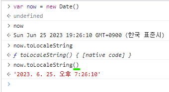
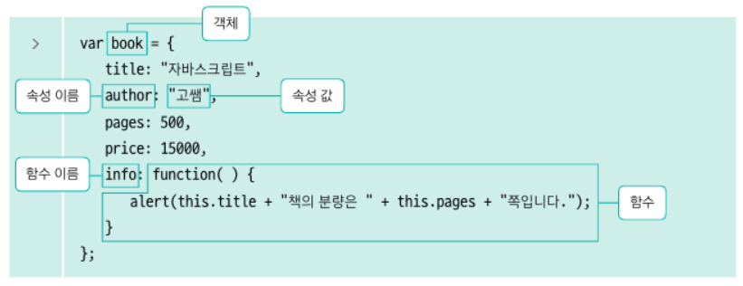
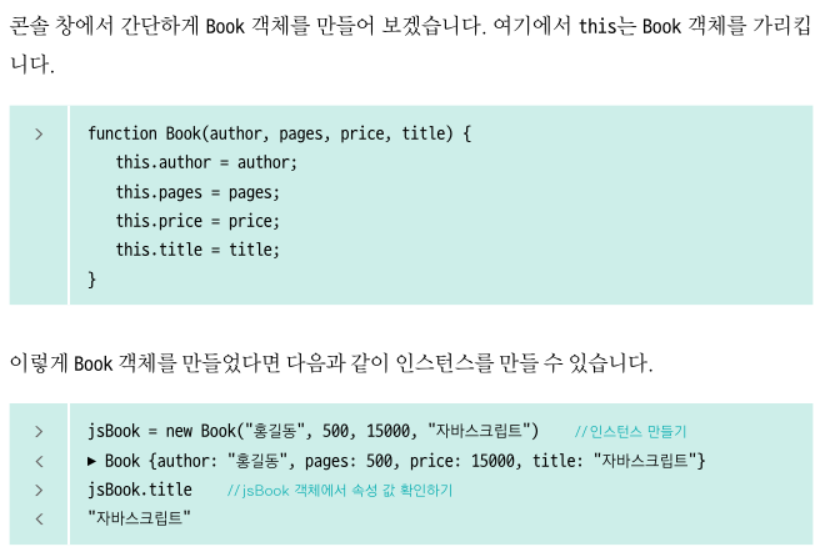
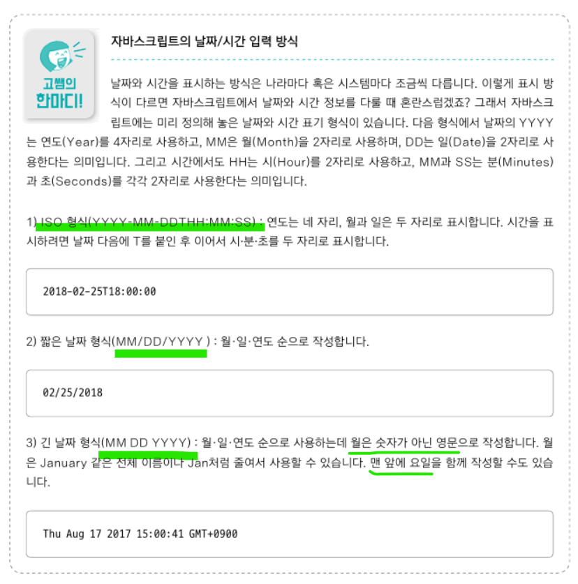
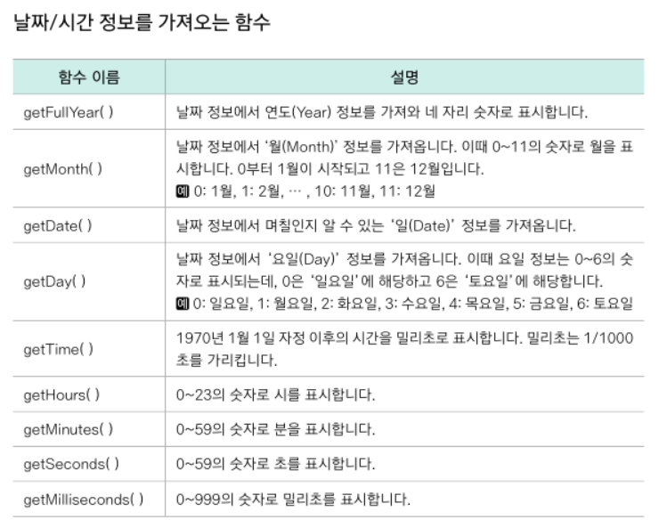
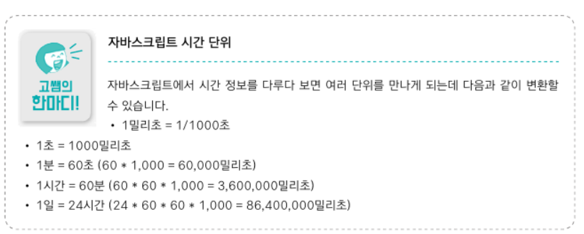
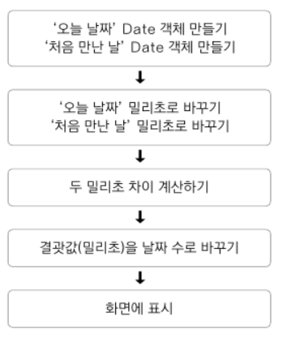

<br/>

### 6-1 객체란?
- 자바스크립트는 웹 사이트나 웹 애플리케이션을 프로그래밍하는 언어이므로 **웹 브라우저, 웹 문서와 관련된 모든 것**들을 객체로 인식
- 객체
  - 자료를 저장하고 처리하는 기본 단위
  - 여러 정보를 가지고 있는 복합 자료형
  - 구성요소 : 프로퍼티(Property)
    - 키(key)와 값(value)으로 구성
      - 키는 프로퍼티를 식별하기 위한 식별자(identifier). 재선언하면 덮어씀
    - 값이 함수인 프로퍼티를 메소드라고 부름
    - 즉, 데이터(프로퍼티)와 그 데이터에 관련된 동작(메소드)으로 이루어짐
  ```
  const person = {
    // 키 : 값

    // 프로퍼티
    name : 'Sarah', 
    age : 30,

    // 메소드
    sayHello : function() { 
      console.log('안녕하세요!');
    },
    getBirthYear : function() { 
      const currentYear = new Date().getFullYear();
      return currentYear - this.age;
    }
  };

  // 빈 객체 생성
  var emptyObject = {};
  ```
- 첫 글자가 대문자로 시작하는 것은 객체를 나타냄
- 사용법 : 객체.속성, 객체.메서드()
  - 예) 네비게이터의 벤더 속성  : 저장된 브라우저 제조업체 정보
  - 콘솔창에서 마침표(.) 입력하면 사용할 수 있는 속성, 함수, 이벤트 처리기 목록 나타남 
  - 예) 윈도우 객체 안의 요소 보기 
    - f가 표시되어 있는 요소들은 함수를 의미
    - 그래서 사실 alert() 함수는 Window 객체의 메서드였어
- Window 객체는 모든 객체를 품고 있는 최상위 객체이므로 함수이름만 사용 가능
  ```
      window.alert("안녕하세요?")

      // window 생략 가능
      alert("안녕하세요?")
  ```
  - 실습) window.open("주소") : http:// 안 써주면 안 뜸 
- 프로토타입 (prototype) : 기본 틀 <br/>
  vs 인스턴스 (instance) : 프로토타입을 사용해 구현한 개별 객체
  ```
  var 변수이름 = new 객체();
  ```
  - 예) Date객체의 인스턴스를 만들어서 now 변수에 저장하고 콘솔창에 실행시키면
  소스코드를 입력한 날짜와 시간 표시됨 (함수 소괄호() 까먹지 말기!!) <br/>
  
- 객체의 속성과 함수를 정리해놓은 사이트 https://developer.mozilla.org/ko/docs/Web/JavaScript/Reference/Global_Objects
- 예제 : 무작위 수 프로그램 만들기
  - Math객체의 random() 함수 사용
  - 1에서 100 사이의 수 : Math.floor(Math.random()*100 + 1)) ( new 없이 대문자로)
  - 
- 객체의 종류
  - 내장 객체 (Built-in Object)
    - 프로그래밍에서 자주 사용하는 요소를 미리 객체로 정의해 둠
    - Date : 날짜, 시간과 관련된 객체
    - Number, Boolean, Array, Math 등등
    - 
    - Math 객체
      - 함수 : abs(x), cbrt(x)-세제곱근, ceil(x)-천장 함수, floor(x)-바닥 함수, random()-0~1사이 난수 생성, round(x)- 소수점 반올림
    - **문서 객체 모델 (DOM)** => 8장
      - 객체를 사용해 웹 문서를 관리하는 방식
      - Document 객체 : 웹 문서 자체를 담는 객체
      - Image 객체 : 웹 문서 안의 이미지를 관리하는 객체
      - 이미지, 링크, 텍스트, 빌드 등등
    - 브라우저 객체 모델 => 10장
      - 웹 브라우저의 정보를 객체로 관리
      - 주소 표시줄, 창 크기 등
      - Navigator 객체 : 사용 중인 브라우저 종류, 버전을 담는
      - History 객체 : 브라우저에 방문한 기록을 남기는
      - Location 객체 : 주소 표시줄 정보 담는
      - Screen 객체 : 화면 크기 정보가 들어있는
  - 사용자 정의 객체
    - 앞의 예제 person

<br/>
<br/>

### 6-2 사용자 정의 객체 만들기
- 대표 방법 2가지 : 객체 리터럴, 생성자 함수
- 리터럴(Literal) : 프로그래밍에서 자료를 표기하는 방식
  - 리터럴을 사용해서 표기한다. = 변수 선언과 동시에 값을 지정해주는 표기 방식
  - var a = 10;
- 객체 리터럴
  - 공통의 속성, 함수가 별로 없다면 굳이 여러 객체를 하나의 틀로 묶을 필요 없어.<br/>
    즉, 각 객체를 따로 정의하는 게 편리할 때 => 리터럴 표기법 사용
  
  - 객체 사용
    ```
    book.title, book.info()
    ```
  - 속성 추가

    ```
    book.새속성 = "값"
    ```
  - 실습 : object.js
- 생성자 함수
  - 객체 틀을 만들어두고, 여러 개의 인스턴스 찍어낼 때
  - 생성자 함수 : 객체를 만들어 내는 함수
  - this 예약어 사용하여 객체 정의, **보통 첫 글자 대문자** / new 예약어로 인스턴스 생성 가능 
  - 실습 : book.js
    - 배열을 만들면 인덱스 번호가 붙음

<br/>
<br/>

### 6-3 Date 객체를 활용해 기념일 계산기 만들기
- Date() 인스턴스 생성
    ```
    // 현재 날짜 정보
    new Date()

    // 시간 기본값 : 오전 9시
    new Date("YYYY-MM-DD")

    // 날짜 기본값 : 1일
    new Date("YYYY-MM")

    // 시간 키워드 T, 국제 표준시 키워드 Z
                    // 입력한 시간 +9시간인 한국 표준시가 담김
    new Date("YYYY-MM-DDThh:mm:ssZ")
    ```
- 자바스크립트의 날짜/시간 입력 방식
- Date 객체의 주요 함수
  - get 가져온다
    - getMonth() 결과값 **0 부터 시작**. 즉, +1을 해야 실제 '월'에 해당하는 숫자 얻을 수 있음
  - set 설정하다
  - getTime()
    ```
    // 현재 시간의 타임스탬프
    const now = new Date();
    const timestamp = now.getTime();
    console.log(timestamp); // 예: 1624638554895
    ```
    - 1970년 1월 1일 00:00:00(UTC)을 기준으로 시간이 얼마나 흘렀는지
    - 단위는 밀리초(Milli seconds)
- 특정 날짜로부터 며칠 전/후 계산하기
  ```
  // 오늘 날짜로부터 50일 지난 후의 날짜
  now.setDate(now.getDate()+50)
  ```
- 실습 : 디데이 계산기 (dday.js)
  - 목표
    - 1 : 처음 만난 날로부터 현재까지 며칠 지났는지
    - 2 : 100일, 200일, 1년, 500일 되는 날짜 며칠인지
  - 알고리즘 고민<br/>
  - 1일 = 24시간\*60분\*60초\*1000밀리초
    - 날짜를 계산할 때 밀리초를 사용하면 편함
    - 날짜로 다시 되돌릴 때 정수로 찾아주는 것 잊지 말기!
- 실습 : quiz2
  - 생성자 함수로 객체를 만들면 선언만 한 상태야. 꼭 new로 인스턴스 생성해 줘야 해
    - "객체.함수"가 함수가 아니라는 에러가 뜸
    - 인스턴스 생성 후 "인스턴스.함수"로 사용해야 해 !!!!
   

<br/>
<br/>