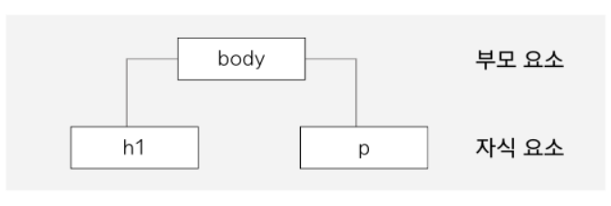
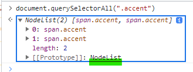
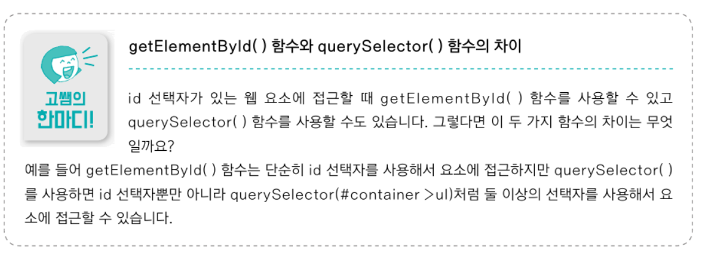
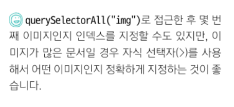

<br/>

### 8-1 문서 객체 모델(DOM) 이란?
- 돔 DOM (Document Object Model)
  - 정의 : 웹 문서의 모든 요소를 자바스크립트를 이용하여 조작할 수 있도록 객체를 사용해 문서를 해석하는 방법
  - 즉, 웹 문서의 텍스트, 이미지, 표 등등의 모든 요소 => 객체
- document : 웹 문서 자체를 가리키는 객체 ( ∈ DOM )
  - 웹 문서의 소스를 전부 담고 있음
- DOM 트리
  - 부모요소, 자식요소로 계층 구조 
  - 노드(Node) : 웹 문서의 요소나 속성. 요소가 품고 있는 텍스트, 이미지도 모두 노드 
  - 가지 : 노드와 노드 사이의 연결 관계
  - 
    - 태그 : 요소(Element) 노드
    - 태그가 품고 있는 텍스트 : 텍스트(Text) 노드
    - 태그의 속성 : 속성(Attribute) 노드
    - 주석 : 주석(Comment) 노드
  - 최상위 노드 : 루트 노드 (html이겠지)
- DOM 트리 확인할 수 있는 사이트 : https://software.hixie.ch/utilities/js/live-dom-viewer/
  - 태그는 보라색, #text:는 텍스트 노드, 값이 없는 건 줄 바꿈

<br/>
<br/>

### 8-2 DOM **요소**에 접근하기
- CSS의 선택자(Selector)를 사용해서 접근
- getElementById()
  - id 선택자로 접근
- getElementsByClassName()
  - 엘리멘"츠" s가 붙은 것 확인 => HTMLCollection 객체 반환
    - HTMLCollection : 여러 개의 HTML요소를 담고 있는(Collection)자료 형식. 배열과 비슷
    - 인덱스 사용해서 특정 요소에 접근
  - 
- getElementsByTagName()
  - id, class 선택자가 없을 땐 위의 방법 못 씀
  - 태그 이름을 찾아 DOM 요소에 접근
  - 엘리멘"츠" s가 붙은 것 확인 => HTMLCollection 객체 반환
- querySelector(), querySelectorAll()
  - id(#), class(.), 태그 이름(기호 없음) 모두 사용 가능
  - 여러 요소 가능한 class, 태그 이름에 querySelector() 사용 => 첫 번째 요소에만 접근
  - querySelectorAll() => NodeList 반환 (HTMLCollection와 똑같이 사용하면 돼)
  - 
- getElementById() 와 querySelector()의 차이 : querySelector()는 둘 이상의 선택자 사용 가능
  - 인덱스로는 한계 있을 때, 자식선택자(>) 사용하면 좋아 
<br/>
<br/>

### 8-3 DOM 요소의 **속성**에 접근하기
- 속성 노드에 접근하면 HTML 요소의 속성 값을 원하는 값으로 수정 가능
- getAttribute(), setAttribute()
  - getAttribute(속성) : 속성에 접근
  - setAttribute(속성, 값) : 접근한 속성의 값 바꾸기
    - 없다면 새로 추가되고, 있다면 수정됨
- setAttribute() 함수 대신, 속성 상용 가능
- 실습 상황 : 선택한 이미지 표시하기
  - 내가 수정하려는 id, class, 태그 이름 등을 확인
  - 로직 생각하기
    - 작은 사진에 onclick 속성 추가
    - onclick에 걸린 함수는 showBig
    - showBig은 큰 사진의 src 요소의 값을 (클릭한) 작은 사진의 src요소의 값으로 수정
  - 작은 사진 여러 개 => for문 돌면서 onclick 붙이기

<br/>
<br/>

### 8-4 DOM에서 이벤트 처리하기
- 5장에서 학습했던 이벤트 처리기
  - HTML 태그 안에서 이벤트 처리기 연결 => 단점 많아서 잘 사용 x
    - 하나의 요소에 하나의 이벤트 처리기만 사용 가능
    - 중간에 이벤트나 연결 함수를 바꾸려면 HTML 소스를 수정해야 함
  - DOM 요소에 이벤트 처리기 연결
    - 요소를 스크립트로 가져와 변수에 저장한 후 ".onㅇㅇㅇ = 함수" 로 사용
- addEventListener()
  - 이벤트가 발생한 요소에 이벤트 처리기를 연결해 주는 함수
  - 한 요소에 여러 이벤트 동시에 처리 가능
  - 특정 요소 뿐만 아니라 Document객체, Windwo객체 등 어디서든 사용 가능
  - ```
    // 가져온 웹 요소를 변수에 담고
    변수.addEventListener(이벤트 유형, 함수, 캡쳐 여부)
    ```
    - 처리할 이벤트 유형 : 예) "click", "mouseover"
    - 함수 : 이벤트가 발생했을 때 실행할 명령, 함수
    - 캡쳐 여부 : 이벤트를 캡처링하는지 여부를 지정 가능
      - false 버블링 : 기본값. 즉, 생략하면 false
      - true 캡처링
      - 이벤트 캡처링 : DOM의 부모 노드에서 자식 노드로 이벤트가 전달되는 것
      - 이벤트 버블링 : DOM의 자식 노드에서 부모 노드로 이벤트가 전달되는 것
      - 이 책에서는 다루지 x
      - 참고 : https://velog.io/@tlatjdgh3778/이벤트-버블링과-캡처링에-대한-정리

<br/>
<br/>

